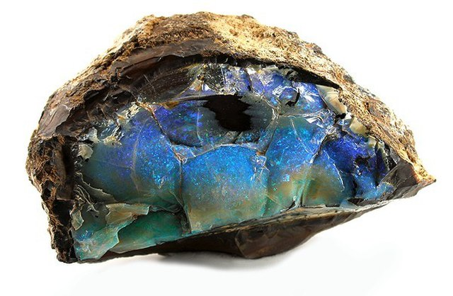

# 2022-10-31 Full-Stack Python/JavaScript Day Class

Repo for the PDX Code Guild Python Full Stack day course starting 10/31/2022

Class is held from **October 31st, 2022 to February 15th, 2023**
M-F 9:30 am – 4:30 pm



### Holidays
- November 8th (Election Day -- go vote!)
- November 24th (Thanksgiving)
- November 25th (Day after Thanksgiving)
- December 26th
- (four more days TBD)


### Staff

- Danny Burrow, Instructor
  - danny@pdxcodeguild.com

- Gage Liebl, TA

## Capstone Dates:

Capstone proposal due: TBD

Presentation Day: February 15th, 2023  


<!-- ## Django Labs Assigned:

| Lab   | Name                   | Date Assigned | Due By Start Of Class | Hard Due Date |
| ----- | ---------------------- | ------------- | --------------------- | ------------- |
| 00    | Polls                  | Jun 8th       | Jun 13th              |               |
| 01    | Todo List              | Jun 13th      | Jun 20th              | Jun 27th      |
| 02    | URL Shortener          | Jun 15th      | Jun 20th              | Jun 27th      |
| 03    | Chirp                  | Jun 21st      | Jun 27th              | Jul 5th       |
| 04    | Students API           | Jul 14th      | Jul 20th              | Jul 28th      |
| 05    | Pokedex                | Jul 15th      | Jul 20th              | Jul 29th      | -->

<!-- ## JavaScript Labs Assigned:

| Lab   | Name                   | Date Assigned | Due By Start Of Class | Hard Due Date |
| ----- | ---------------------- | ------------- | --------------------- | ------------- |
| 01    | Pick 3                 | Jun 27th      | Jul 5th               | Jul 11th      |
| 02    | Pick 3                 | Jun 27th      | Jul 5th               | Jul 11th      |
| 03    | Pick 3                 | Jun 27th      | Jul 5th               | Jul 11th      |
| Group | Todo List              | Jul 1st       | Jul 5th               | Jul 15th      |
| 04    | Vue Todos              | Jul 5th       | Jul 11th              | Jul 19th      |
| 05    | Quotes in Vue          | Jul 7th       | Jul 11th              | Jul 21st      |
| 06    | Mini-Capstone          | Jul 11th      | Jul 14th              | Jul 25th      | -->


<!-- ## HTML/CSS Labs Assigned:

| Lab   | Name                   | Date Assigned | Due By Start Of Class | Hard Due Date |
| ----- | ---------------------- | ------------- | --------------------- | ------------- |
| 01    | Bio                    | May 23rd      | May 31st              | Jun 6th       |
| 02    | Company Landing Page   | May 25th      | May 31st              | Jun 8th       |
| 03    | Blog                   | May 26th      | May 31st              | Jun 9th       |
| 04    | Burrito Order Form     | May 31st      | Jun 6th               | Jun 14th      |
| Group | Flask Todos            | Jun 1st       | Jun 1st               | Jun 15th      |
| 05    | Flask Redo             | Jun 2nd       | Jun 6th               | Jun 16th      |
| 06    | Personal Portfolio     | Jun 3rd       | Jun 7th               | Jun 17th      | -->

## Python Labs Assigned:

| Lab   | Name                   | Date Assigned | Due By Start Of Class | Hard Due Date |
| ----- | ---------------------- | ------------- | --------------------- | ------------- |
| 01    | Unit Converter         | Nov 1st       | Nov 4th               | Nov 15th      |
| 02    | Number To Phrase       | Nov 1st       | Nov 4th               | Nov 15th      |
| 03    | MOB - Average Numbers  | Nov 2nd       | N/A                   | N/A           |
| 04    | Blackjack Advice       | Nov 2nd       | Nov 7th               | Nov 16th      |
| 05    | Pick 6                 | Nov 3rd       | Nov 9th               | Nov 17th      |
| 06    | Credit Card Validation | Nov 4th       | Nov 9th               | Nov 18th      |
| 07    | ROT13                  | Nov 4th       | Nov 9th               | Nov 18th      |
| 08    | Peaks and Valleys      | Nov 4rd       | Nov 10th              | Nov 18th      |
| 09    | ARI                    | Nov 7th       | Nov 10th              | Nov 21st      |
| 06.1  | CC Validation REDUX    | Nov 9th       | Nov 11th              | Nov 23rd      |
| 10    | MOB - Hangman          | Nov 7th       | N/A                   | N/A           |
| 11    | Contact List           | Nov 10th      | Nov 15th              | Nov 28th      |
| 12    | ATM                    | Nov 11th      | Nov 16th              | Nov 28th      |
| 13    | Compass                | Nov 14th      | Nov 17th              | Nov 28th      |
| 14    | Automated Tests        | Nov 14th      | Nov 18th              | Nov 28th      |
| 15    | MOB - Tic-Tac-Toe      | Nov 15th      | N/A                   | N/A           |
| 16    | Dad Joke API           | Nov 17th      | Nov 21th              | Dec 1st       |
| 17    | Quotes API             | Nov 17th      | Nov 23rd              | Dec 1st       |
<!--| 18    | Mini-Capstone          | Nov 18th      | Nov 23rd              | Jun 1st       | -->


## Student Presentations

At the end of the Python and JavaScript sections, you'll give a presentation on a "mini capstone" of your choice. This is practice for your capstone presentation which you'll give on the last day of class.

These presentations help you practice communicating technical topics in English. Being able to speak intelligently about programming is almost as important as programming itself. This skill will allow you to better talk to interviewers, managers, clients, coworkers, and more.

In all three presentations, you should first explain the development process and the different parts of your code. Then run the application and show its features and interaction (entering data, seeing results, etc). Here are some questions to contemplate while planning out your presentation:

- what problem does your application solve? what is the core function it performs?
- how did you go about planning?
- what major issues did you encounter during the course of development? how did you go about overcoming them?
- how did your vision for the project change over time?
- what part did you like the most? least?
- what is the future of the project? what features (if any) will you work on next?

## Getting Unstuck

- Write pseudocode in English
- Add comments to explain your process to yourself
- Use functions to "black box" pieces of code
- Break code into logical bits
- Only do one thing at a time
- Don't do too much on one line
- There's no such thing as too many `print()`s

## Odds and Ends

Uploading Files with VueJS and Axios  
https://serversideup.net/uploading-files-vuejs-axios/

A Friendly Guide to Promise.all  
https://levelup.gitconnected.com/a-friendly-guide-to-promise-all-68e7cd57b65d

SQL Island  
https://sql-island.informatik.uni-kl.de/

Select Star SQL  
https://selectstarsql.com/

SQL Murder Mystery  
https://mystery.knightlab.com/walkthrough.html

An Illustrated (and Musical) Guide to Map, Reduce, and Filter Array Methods  
https://css-tricks.com/an-illustrated-and-musical-guide-to-map-reduce-and-filter-array-methods/

Custom User Model  
https://learndjango.com/tutorials/django-custom-user-model

Tips for using many-to-many fields  
https://www.revsys.com/tidbits/tips-using-djangos-manytomanyfield/

Willam Vincent's tutorials and articles  
https://wsvincent.com/

Django by example  
https://www.youtube.com/playlist?list=PLAF3anQEEkzS-mjdX7s-D63bjLWRdhuFM

Python Django tutorial  
https://www.youtube.com/playlist?list=PL-osiE80TeTtoQCKZ03TU5fNfx2UY6U4p

Django girls tutorial  
https://tutorial.djangogirls.org/en/

Django polls tutorial  
https://docs.djangoproject.com/en/2.1/intro/tutorial01/

Git branching practice  
https://learngitbranching.js.org/

Oh Shit Git  
http://ohshitgit.com/

Atlassian Git Tutorials  
https://www.atlassian.com/git

Vue Video Tutorial and Solution Repo  
https://www.youtube.com/watch?v=5LYrN_cAJoA&list=PL4cUxeGkcC9gQcYgjhBoeQH7wiAyZNrYa  
https://github.com/iamshaunjp/vuejs-playlist/tree/lesson-1

Vue Introduction Documentaion  
https://vuejs.org/v2/guide/

jQuery vs Vanilla vs Vue/React/Angular  
https://www.academind.com/learn/javascript/jquery-future-angular-react-vue/

Start an HTTP server on your local machine:

```bash
cd project/file/path
python -m http.server
```

XMLHttpRequest properties/methods/etc  
https://developer.mozilla.org/en-US/docs/Web/API/XMLHttpRequest

Using XMLHttpRequest  
https://developer.mozilla.org/en-US/docs/Web/API/XMLHttpRequest/Using_XMLHttpRequest

Awesome CSS  
https://github.com/ikkou/awesome-css

Sass Basics  
https://sass-lang.com/guide

BEM  
http://getbem.com/introduction/

Webhook Request Tester  
https://webhook.site

MDN: How To Style Forms  
https://developer.mozilla.org/en-US/docs/Learn/HTML/Forms/Styling_HTML_forms  
https://developer.mozilla.org/en-US/docs/Learn/HTML/Forms/Advanced_styling_for_HTML_forms  
https://developer.mozilla.org/en-US/docs/Learn/HTML/Forms/How_to_build_custom_form_widgets

Bootstrap Documentation  
http://getbootstrap.com/docs/4.1/getting-started/introduction/

Grid Garden  
https://cssgridgarden.com/

Flexbox Froggy  
http://flexboxfroggy.com/

Grid or Flexbox?  
https://www.youtube.com/watch?v=hs3piaN4b5I

CSS Diner  
https://flukeout.github.io/

CSS-Tricks  
https://css-tricks.com  
https://css-tricks.com/snippets/css/a-guide-to-flexbox/  
https://css-tricks.com/snippets/css/complete-guide-grid/

Adobe Color  
https://color.adobe.com/create

Google Fonts  
https://fonts.google.com/

Font Awesome  
https://fontawesome.com/icons?d=gallery&m=free

The Four Major Programming Paradigms  
http://www.eecs.ucf.edu/~leavens/ComS541Fall97/hw-pages/paradigms/major.html

More Programming Paradigms  
http://cs.lmu.edu/~ray/notes/paradigms/

Big-O Cheat Sheet  
https://www.bigocheatsheet.com

More about sorting  
https://visualgo.net/en/sorting?slide=1

15 Sorting Algorithims in 6 Minutes  
https://www.youtube.com/watch?v=kPRA0W1kECg

Awesome Python (list of frameworks/libraries/software/resources)  
https://awesome-python.com/

RexExr  
https://regexr.com/

Regex Crossword  
https://regexcrossword.com/

Lena, the first JPEG  
https://www.wired.com/story/finding-lena-the-patron-saint-of-jpegs/

All Algorithms implemented in Python  
https://github.com/TheAlgorithms/Python

Python concept practice problems (may require registration, may not be Python 3)  
http://www.asmarterwaytolearn.com/python/index-of-exercises.html

Are exceptions good practice? (Includes list of exceptions and a lot of code philosophy)  
https://stackoverflow.com/questions/16138232/is-it-a-good-practice-to-use-try-except-else-in-python

Official Python Style Guide (PEP 8)  
https://www.python.org/dev/peps/pep-0008/

PEP-8 Tutorial and Guide  
https://www.datacamp.com/community/tutorials/pep8-tutorial-python-code

Pitfalls of Floating Point Numbers and Work-Arounds  
https://docs.python.org/3/tutorial/floatingpoint.html

Command Line Cheat Sheet  
https://www.git-tower.com/blog/command-line-cheat-sheet/

Git Cheat Sheet  
https://www.git-tower.com/blog/git-cheat-sheet

Generating a new SSH key and adding it to the ssh-agent  
https://help.github.com/articles/generating-a-new-ssh-key-and-adding-it-to-the-ssh-agent/

Adding a new SSH key to your GitHub account:  
https://help.github.com/articles/adding-a-new-ssh-key-to-your-github-account/

## Outside Resources

- Python:
  - Practice:
    - https://www.hackerrank.com/domains/tutorials/30-days-of-code
    - http://codingbat.com/python
    - https://codefights.com/
  - Textbooks:
    - https://automatetheboringstuff.com/
  - Cheat Sheets:
    - https://ehmatthes.github.io/pcc/cheatsheets/README.html
    - https://learnxinyminutes.com/docs/python3/
- Frontend (HTML/CSS/JS):
  - https://www.freecodecamp.org/ (Practice, projects, (almost) textbook all-in-one!)
  - https://sayazamurai.github.io/python-vs-javascript/#control-flow (Python3 and ES6 JS side by side comparisons)
  - https://sass-lang.com/guide (SASS: CSS preprocessor tutorial)
  - https://vuejs.org/v2/guide/ (Vue.js official guide)
  - https://www.youtube.com/watch?v=5LYrN_cAJoA&list=PL4cUxeGkcC9gQcYgjhBoeQH7wiAyZNrYa (Vue.js video tutorial)
    REPO: https://github.com/iamshaunjp/vuejs-playlist/tree/master
- Django:
  - https://tutorial.djangogirls.org/
  - https://docs.djangoproject.com/en/3.2/intro/tutorial01/ (Official tutorial)
